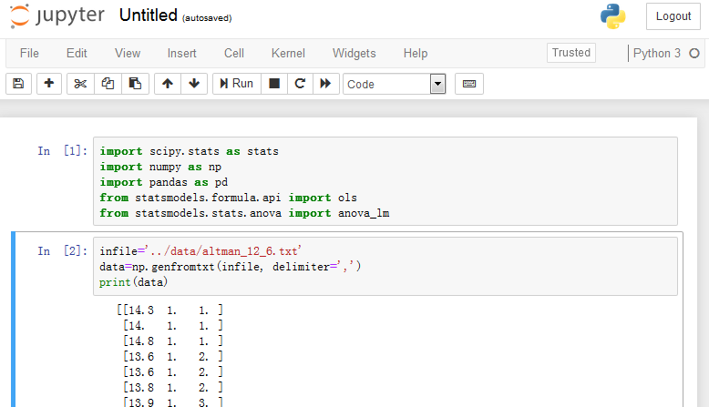
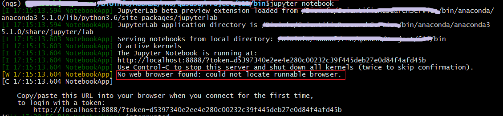

## ipython、ipython notebook的安装使用

- 别名：
    - 也叫jupyter notebook；
    - 不限于python语言，R，perl等也可以；

- why（为啥非得安ipython和notebook）：
    - 代码、注释和运行结果3者如果可以一起保存，那么写文档留存就很省事，方便自己看也方便别人看；
    - 以及，pycharm本地和shell的交互也可以加快工作效率。

- what（那么这个ipython和ipython notebook咋用）：在我看来这个配置使用不难，但是关键要明白这个是干啥的！
    - IPython Notebook使用浏览器作为界面，向后台的IPython服务器（比如你的服务器）发送请求，并显示结果。上图，清晰明了：

    

那么，要想用这个东西，需要做这样几件事了：
1.安装ipython，确保有ipython notebook可以调用；
2.配置ipython notebook，确保你能在浏览器通过https://localhost:8888 进行程序的运行，结果的保存（可以保存为.py/.ipynb/.md/.html等多种格式，很方便）。

---

### 1.安装ipython，确保有ipython notebook可以调用；
基本的安装就不写了，主要记录一下可能遇到的问题及解决的办法。
### 配置ipython notebook，最经常遇到的问题就是远程无法访问、页面打不开的问题，我也是遇到了，各种查网上很多教程才解决这个问题，记录一下。
[参考帖子CSDN-本地使用服务器端运行的Jupyter Notebook](https://blog.csdn.net/Papageno_Xue/article/details/79710708)

- 启动notebook进行访问，如果无法访问就需要配置了
- 配置server使得在web输入网址可以访问ipython notebook
1) 首先输入ipython生成秘钥
2) 生成jupyter的config文件
3) 修改配置文件：~/.jupyter/jupyter_notebook_config.py
4) 在local上，打开浏览器，输入：https://serverIP:8888/
    - cenOS的server IP查看：ip add
---
**以下，由于时间紧任务多，捣鼓了半天没有解决的问题，记录下来是以后待解决摸索的~~~~~~~~~~**

基本能做到以上两点就可以顺利使用了，当然，我还希望：
3.直接把我ipython notebook网页上的东西可以推送到github上面；
    - [参考帖子待配置：将Jupyter自动发布到GitHubPages](https://www.jianshu.com/p/d78e9f741a79)
4.我的python有多个版本，然后我也有多个虚拟环境，更有多个ipython notebook，那么如何保证我调用的ipython notebook是我期望的路径下的？
    - 有个关键词是：Jupyter lab 安装及多kernel配置
5.我还希望我的ipynb文件是带有markdown目录跳转格式的；
    - [参考帖子待配置：为Jupyter Notebook添加目录功能](https://blog.csdn.net/tina_ttl/article/details/51031113)