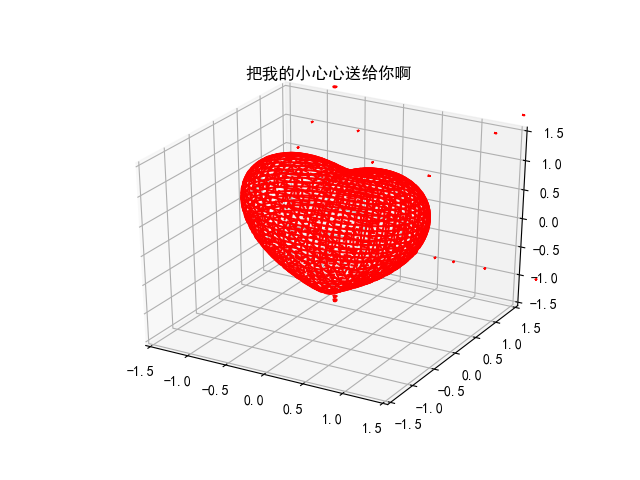

	

# - 坚持使用GitHub的打卡、小心得记录

### - QuSusu
### - “人生，一定不是场百米赛，一定是场马拉松，是长跑。” 其实你现在会什么并不重要，你要去尝试更多的东西！姐姐我正在跑马拉松呢，嘿哈！
### - 希望从2018年4月18日开始，可以每天坚持更新git，和健身一样成为自己的一个习惯！
### - 4月26日，今天关注了之前fork过的一个人的公众号，在上面看了一篇推文觉得写得很好，一定要记录下不然我会忘：作者最直接的观点就是说“就像跑步，太用力的人跑不远。”生活可能像一根弹簧，最好的状态是张弛有度，太紧-压力太大，太松-没有活力。真正的坚持归于平静，靠的是温和的发力，而不是时时刻刻的刺激。努力不应该是某种需要被时常觉知的东西，真正坚持到最后的人，是有恰到好处的喜欢和投入。共勉~
### - 做了几天的打卡记录之后我发现这个文档还是写的有点复杂了，而且内容有点“四不像”，既不完全是具体内容的说明文档，也不是简单明了的打卡记录，所以把这个打卡记录的内容精简了一下，如果以后有某个内容比如git相关的确实需要一个详细的notes，那么建议新建立一个文档用于记录。

---

## - Day1
## - Day2
- 完成了一个文档，但是是word版的，粘贴过来也不够好看，后续有时间再改成md格式的吧(毕竟不是有人说，完成比完美更重要)；
- 今天在local把git安装了、MarkdownPad安装好了，然后回忆了一下今天shifu给我演示的操作，也是小小的积累；

## - Day3
- 啊哈哈哈哈，今天，终于有时间写程序啦！虽然发现好多东西不会，可是还是得坚持住，应该会厚积薄发的吧？！
- 做好自己想坚持做的事！

## - Day4
- 总觉得之前的打卡小心得这个文档排版不好，在Git上的页面显示也不好看，也不知道什么原因好多md格式显示不出来；加上之前word各种文件突然丢失导致很多文档要重新写，所以安装了被推荐的yuwriter，再试试……
- 结果呢，在本地更新文档之前忘记先把昨天update的内容fetch下来了，我写完了要pull的时候，就提醒我有问题，让我对比哪一行是留的，颜色看的我都眼花了，幸好不是特别重要的东西，所以了解一下git遇到有冲突的文档不知道该保留哪一行时，需要知道不同颜色代表啥意思哈哈哈哈。感觉每天戏好多啊~
	- 蓝色标识是提示你会作为改变的文本被保存的，不要就点击一下。
	- 绿色标识表示修改的内容。
	- 红色标识表示删除。
	- Summary就是这次改动的总结，我们也可以理解为标题（必填），而Description可以理解为详细更改内容（选填）

## - Day5
- 今天学会了个fork，哈哈，然后呢，手误fork了一个repo，最后不想要了，又学会了delete；
- 感觉yuwriter的排版还是不熟；
- 写了一个下周更新git的文档计划；

## - Day6
- 对今天cnn的内容进行了总结；
- 对一些疑问进行了总结；

## - Day7
- pycharm连接GitHub的配置、操作；简书上有一个教程写的还蛮清楚的，可以供参考：[pycharm连接github](https://www.jianshu.com/p/231584cb735b)

## - Day8
- 今天更新的程序相关内容有点少，好多文档性紧急的工作……无奈奥！明天一定不这样……

## -Day9
- 更改邮箱账户，star了几个比较好的repo；以及设置.gitignore文件、requirements.txt来安装packages；
- 在pycharm里安装md插件；
- python虚拟环境的设置；

## Day10
- 把现阶段的所有notes文档补充好，可优化的点也已经优化，以及学着用md格式来改字体和颜色；
- cnn文档对图片进行了update；
- 继续TensorFlow的代码

## Day11
- folk-fork（这个错误竟然都被发现了，感慨别人的细心，以及提醒自己不可以懈怠！）；
- 发现昨天cnn_notes的帖子里图片没有更新成功，重新弄了一下，以及add some words；
- 被推荐了很好的学习Deep learning基本原理的特别好的帖子，可同时也有了一些困惑：要学的东西很多，每一样都是需要长期投入的过程，但又要兼顾学业、打杂、学习等等一系列的事情，可能得想想学习任务优先级了；还有就是除了提高效率，是不是也要更努力和focus一点了……
- run tf的程序，超级超级慢（3.5h），然后还出了bug，debug的时候就死机了……明天继续弄吧；
- md设置背景颜色；
- 没来得及弄的：http://www.ribobio.com/sitecn/Service11_417.html
- tmp文档；
- 文献看了，没写成总结文档；

## Day12
- 发现昨天的md设置背景颜色没有成功<table><tr><td bgcolor=#C7EDCC> 不知道为什么在pycharm的插件里可以显示，这里却不行呢</td></tr></table>；
- creat a new repo to record eCLIP related info；and add some notes on one reference to it；

## Day13
- 继续文献总结的实验part；
- re-run tf里的bug，估计又会卡机，反正先run了……；

## Day14
- 文献总结的分析part，简单看了下文档；
- 终于找到了tf的bug，自己拼错了一个单词……坑，结果已记录；

## Day15
- tf summary；
- eCLIP related；

## Day16
- tf playground；
- add eCLIP website；

## Day17
- tf cat cnn test；

## Day18
- tf words；
- 文献summary；

## Day19
- tf codes；

_其实这种感觉很好，玩一天之后还记得一定要学习一会然后打卡，但目前的心态更多的是觉得不能输……_

## Day20
- 经常一些md格式在不同的文档中兼容性不好，这个其实挺烦人！换个软件就不显示了。以后尽量固定用pycharm和yuwriter这两个了！不然总在调格式浪费时间。
- CNN cat的例子完成最后的部分；
- 【待尝试解决的问题：】
    - 本机跑TensorFlow时太慢了，经常爆出out of memory的问题，尝试用linux但得解决在当前界面输出图形的问题；
    - linux 终端启动图形化程序界面时报错：No protocol specified (oracle)：XShell+Xmanager实现在XShell中显示远程服务器的图形界面
    - tensorflow笔记：[常用函数说明](https://blog.csdn.net/u014595019/article/details/52805444)
    - JBrowse：[可能是最全的JBrowse基因浏览器介绍](http://chuansong.me/n/1704886452520)、[Official Website](http://jbrowse.org/)
    - 写文档的时间过长了，那么问题来了：到底什么样的内容要写个文档？

## Day21
- python scripts for basic statistics，今天只进行了一部分，画了个巨丑的图，不贴了；
- 这个pandas啊，真是不经常用就忘了啊！
- 【最折磨人的是编码方式和数据类型这两个问题，一直报错，找个时间得研究下；】

## Day22
- python plot: scatter & 折线图（图丑，不传！）；

## Day23
- 研究了一天的统计画图；

## Day24
- 临床信息意义不够明确，信息梳理 & 根据梳理的信息来画图；
- 针对画的图解读样本分布；
- 撰写反馈报告；

## Day25
- 今天比较累，而且代码也只能远程公司进行调试不好操作，所以只记录一些文字性的东西；
- 整理这个几个画图的脚本，虽然任务已经完成，但是其实我对结果不够满意，有一些可以优化的点，分别记录在每个脚本中了；

## Day26
- 解决了一个groupby的问题，但对stack，unstack的数据结构变化还是不够清晰；
- 很郁闷的是subplot2grid多个图显示在一个画布没调出来，总是没有图像显示；

## Day27
- 画图中大部分遗留的问题都解决了，包括那个数据异常的问题，以及根据列的属性提取某一列数值进行绘图；
- linux diff/cmp；**赠人玫瑰手有余香**

## Day28
- reading & comments &summary；
- 项目：t检验，样本统计分布直方图、拟合曲线；
- 个别图形显示的优化；

## Day29
- literature summary;
- codes small changes;
- 撰写反馈报告；

## Day30
- eclip文字补充，准备汇报；
- 网站添加；

## Day31
- eclip文字添加，准备汇报PPT；
- 画图的代码修改；

## Day32
- 只对会议的内容进行了summary，太累了；

## Day33
- 会议总结；

## Day34
- 趁着还有印象对会议上涉及到的、与我目前研究相关或者可以作为材料装的那种图，对应的文献扫一眼；
- 流形学习基本知识；

---
# 第二轮计划开始！！！

## Day35（第二轮计划开始，为期60天）
- 对会议素材进行总结，查找文献，以及对应知识点的学习；

## Day36
- 感觉没有给一周定个目标或者计划的时候，更新git就不够积极，而且不知道弄什么，也荒废了代码，所以还是得给每一周定一个小目标；
- 所以虽然这一周就剩下几天了，还是要定下后续的计划，更新plan.md文件；

## Day37
- 中期题目、提纲、初稿基本完善；
- 自己敲某人的代码，悲催的是我的怎么不显示颜色，好气……突然想起可能是在Windows的原因，回去试试linux！

## Day38
- 项目数据交付、邮件for others；
- 解决Windows下python终端输出的颜色显示问题；
- summary of used plot codes；

## Day39
- 今天不知道更新啥，就结合目前本周的完成情况制定了下周的更新计划；

## Day40
- 看了一些基本的进化树相关的内容，发现又涉及到宏基因组，就写了点文档总结；

## Day41
- notes on the variants basic knowledge；
- ppt完善；
- mega应该不用看了，这个暂时从我的本周plan中移除；

## Day42
- 我今天呢，看了文献，但是呢，我还没有整理处理，怎么办呢，反正我干活了啊！我没有偷懒！

## Day43
- GO注释相关学习笔记记录；
- python心形代码学习（必须贴图嘚瑟啊！）；

## Day44
- 看了下昨天画图的代码，有几个地方没弄明白，简单summary一下，已更新；
- 整理下周要汇报的ppt，已更新；
- 撰写中期报告；

## Day45
- 全天做了好多的ppt相关的东西，程序的话就研究一个吧；
- python image library；

## Day46
- 对于这一天的中断我感到非常的那啥，不能用后悔来形容，因为毕竟已经发生了，只是遗憾，遗憾上面有了一处空白，遗憾这个开头从我这里开始的！
- 但我其实也没办法，我开始弄的时间挺早的，可我真的特别难受，所以其实好的身体之后才有好的成果！

## Day47
- 终于回到北京了，代码没写，就是补充补充这几天的感想吧：
- 第一个感觉就是累啊，缺觉啊，可是明天我还有汇报，挺住！
- 第二个感觉就是好多事情的最终促成，中间是有很多复杂的东西在里面！
- 第三个感觉就是看问题、看人、看事情，要宏观，不要个人主观意识太强！大家其实都不容易……

## Day48
- 昨天忘记写这个记录了，先补上昨天的工作：昨天跟陈大仙学着弄了个简历，以后可以用来装了，啊哈哈哈！

## Day49
- 今天状态也不行啊，刚想偷个懒，老板就给了一堆一堆的活，唉！
- 代码也就是弄弄简历！但也发现了一个fork别人代码时候的更新会有小问题，及时更正，避免以后入坑！

## Day50
- 昨天一直没同步clone成功那个简历的东西，今天重新弄了一下；
- update机器学习相关的文档；

## Day51
- 上午体检，下午就是看端粒相关的文献做ppt；

## Day52
- 简历&paper；悲催的是，格式一直格式不对呢！

## Day53

## Day54

## Day55

## Day56
- 词云工具；
- 好好整理这几天的东西，乱七八糟了，然后就是准备中期的文档、ppt；

## Day57
- 很想说给自己放一个假，今天不更新了，但是越是这样越没法痊愈啊，所以即使是一点点input，那也是进步，以及完成比完美更重要！
- 但悲催的是没有找到那个要更新的文献对应的是哪篇，只是简单的看了觉得这个帖子对NGS的叙述很棒，先记录下网址吧，明天继续找[NGS十年发展史，看这篇就够了 | Nature综述解读](http://www.seq500.com/portal/hot/ngs.shtml)
- 昨天的文献找到了！

## Day58
- 我发现一个很奇怪的现象，就是因为现在我每天在写报告做ppt，加上一些外界因素吧，导致我不知道去更新什么，那么在我心里git更新就变成了一个麻烦事，然后我就产生了厌烦的心理……这有点可怕唉！
- 可是可是呢，我一定要坚持，转眼第二轮60天的计划，也已经超过20天了呢，不错不错，一定不能掉队的！
- [html页面设置](http://www.w3school.com.cn/tags/html_ref_dtd.asp)，先Mark！

## Day59
- single cell sequence research: docs & ppt prepare；
- markkdown两种方式实现页内跳转；

## Day60
- plan for 16-20；
- 每天固定的input感觉还是不够了，老板布置的任务是额外的，感觉还是不够！我自己坚持的东西呢？今天还是看一点点机器学习相关的知识，半个小时也行的；

## Day61
- 今天终于解决一个建立页面显示不出来我想要的格式问题，被扫盲了哈；
- 果然咖啡厅的效率要更高的；

**有时候陷入怪圈怎么也不会，有时候突然发现好简单**
