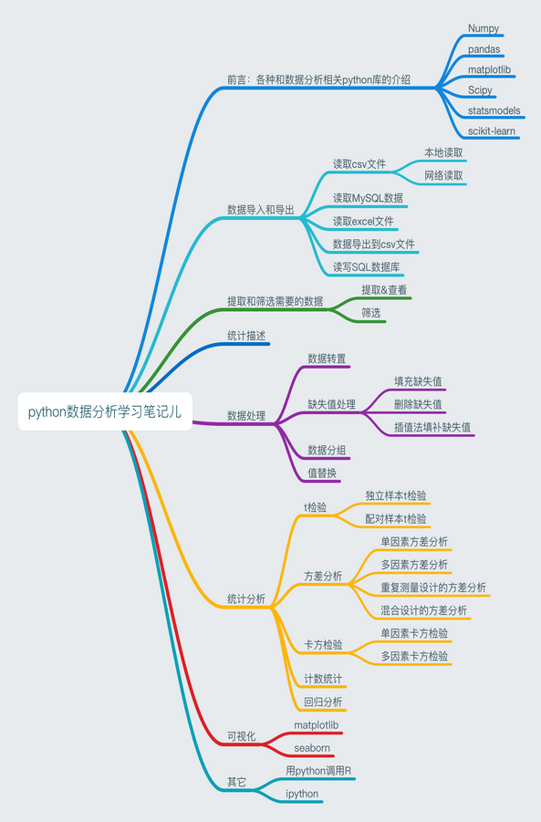

## Start Python & I Love Python!

**Please Follow me, thanks, hahahhahahaha!**

- 既然要开始coding了，那么推荐使用GitHub，养成coding良好习惯！[初次接触GitHub，如何配置来来了解一下](https://github.com/Susuqu/bioinformatics/blob/master/git%E7%9B%B8%E5%85%B3%E4%BD%BF%E7%94%A8%E8%AE%B0%E5%BD%95.md)
- 推荐用ipython notebook来交互shell使用python，好用好用：
    - [别人的帖子：ipython notebook使用教程](https://www.cnblogs.com/giserliu/p/4997144.html)
    - [我写的帖子：ipython、ipython notebook的安装使用](https://github.com/Susuqu/bioinformatics/blob/master/IPythonNotebookConfig.md)

---
学习python的生信菜鸟小白，需要掌握哪些python的基本编程知识呢，我简单总结了一下起初入门的时候会这些就行了：
[python数据分析入门学习笔记](https://www.cnblogs.com/zzhzhao/p/5269217.html#undefined)

