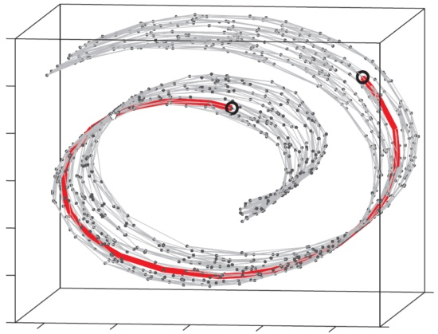

CNN basic knowledges
==========
- Record of some key notes by **QuSusu**.
- Some statements were directly copy from others.
- Start at 2018/04/23, last update at 2018/06/06.
- 其实，我也不知道为啥我要坚持研究机器学习啊~

----
**所谓卷积神经网络，就是会自动的对于一张图片学习出最好的卷积核以及这些卷积核的组合方式，也就是对于一张图片的任务来说，求出最好的图片对于本任务的特征的表达，然后来进行判断** 

[知乎：能否对卷积神经网络工作原理做一个直观的解释？](https://www.zhihu.com/question/39022858)

---

## I.基本概念（后续补充吧，今天来不及写这个了）
[机器学习相关的一个帖子](http://nooverfit.com/wp/category/cnn/)

## II. 参数设定 & 一个卷积过程的例子
### 1.参数设定
一般在我们进行一个CNN训练的时候，会涉及到两大类参数：超参数（Hyperparameters）和参数（parameters）。
- 超参数（Hyperparameters）：是我们根据经验人工给定的值。
- 参数（parameters）：是通过学习训练、不断改变得到的值，比如每次卷积核对应的权重，都是通过不断的给定一个值，然后根据学习情况调整直到找到最优。

超参数分别具体包括哪些过程的哪些值、如何给定这些值一个初始值、偏好值等等，详见下面的表格内容：

|过程|超参数|如何给定对应的初始值|偏好值|举例||
|:---|:---|:---|:---|:---|---|
| 卷积 | 卷积层数 | 人工给定 | 好像没有偏好值 | 2||
|   | 卷积核大小 | 人工给定 | 奇数 | 3x3 ||
|   | 特定卷积层对应的输出数量 | 人工给定 | 无 | 10 ||
| 池化 | 池化层数 | 人工给定 | 无 | 2 ||
|   | 池化后的输出大小 | 人工给定 | 一般会缩小 | 2x2 ||
| Relu | Relu的次数 | 人工给定 | 无 | 2 ||
| 全连接 | 全连接的次数 | 人工给定 | 无 | 2 ||
|   | 全连接的输出特征值个数 | 人工给定 | 无 |首次180，第二次为3 ||
| 其他 | 步长（stride） | 人工给定 | 无 | 2 ||
|   | 边界（padding） | 人工给定 | 无 | zero padding ||

---

### 2.一个卷积过程的例子
在实际做卷积的过程，可能最困惑的就是卷积核大小的选取、数据是由几维变成了几维、CNN的过程是如何的等等问题，那么结合上面关于参数的说明，来看一个非常简单的例子帮助理解数据的维度变换等细节内容：这是一个比较简单的例子：对每一副图片用两层卷积、两层池化、两次relu、两次全连接进行学习，对最后一次全连接的结果（n个特征）通过softmat函数进行分类。

### 3.其他
- 池化的作用：降维，或者说是为了更好的放大特征值之间的差别。
- 全连接：整合所有的特征值然后根据我们给定的个数提取其中关键的特征值，其实也是降维的一种方式（全连接的输出特征值的个数，也是我们人工给定的）。
- relu函数：非线性的转换，其实就是一个分类函数，会把矩阵中所有负数的值变为0。 
- softmax函数：根据经过最后一次全连接的特征值进行分类。softmax函数的作用呢，一是分类，二是给出量化的指标来说明有多大的比例可以分为该类别。

Deep learning knowledges
========================
最开始写这个文档只是想记录下对CNN的理解，今天被推荐了一个很好的深度学习资源相关的帖子：[如何看懂深度学习论文里的数学原理部分？](https://www.zhihu.com/question/266533669/answer/377229055)所以考虑后续是不是文章title要改一下。

TensorFlow Playground
=====================
***From 知乎：***
TensorFlow=tensor(张量)+flow(流动)，张量的流动；TensorFlow Playground的作者想要阐述的侧重点就是“张量如何流动”的。
Playground是一个图形化用于教学目的的简单神经网络在线演示平台，只是一个动态演示的网站，可视化了神经网络的训练过程，有助于加深对神经网络的理解。
知乎上看到一句话觉得形容的很贴切：每个神经元都是“傻傻的”，只会做一件事情，然后通过weight去组合协调，完成一件复杂的任务。而学习/训练的过程不过是去寻找选择最优weight的过程。

website：
- [GitHub-tensorflow playground](https://github.com/tensorflow/playground)
- [Brower-tensorflow playground](http://playground.tensorflow.org/)

图解：
从左到右依次为：数据集，特征值，隐含层和输出层。
- 红色框中表示的参数：迭代次数，激活函数等；
- 绿色框表示数据集、特征集等几个过程；
- 粉色框表示的是特征值的权重；

TensorFlow
==========
重复YL的例子时，虽然大致了解整个流程，但对其中的细节尤其TensorFlow的框架不是太懂，所以就在网上找相应的资源，偶然发现了这个网站：[TensorFlow中文社区](http://www.tensorfly.cn/)，感觉是超级给力的！里面有[TensorFlow完整教程](http://www.tensorfly.cn/tfdoc/tutorials/overview.html)，一些我们熟知的例子：面向机器学习初学者的 MNIST 初级教程、高级教程、卷积神经网络、循环神经网络等等也都有介绍，推荐逐一尝试。

关于cat这个例子里其实有些东西没弄懂，比如像素的转换那个地方，刚好结合上面的网站可以看下相应的原理。
    - tensorflow笔记：[常用函数说明](https://blog.csdn.net/u014595019/article/details/52805444)

Manifold learning 流形学习
==========
于我而言一个新的概念，简单查了下，记录一些内容，好多也不太理解，后续慢慢理解吧。

### 基本概念
流形学习是机器学习、模式识别中的一种方法。
**主要思想是：** 将高维的数据映射到低维，使该低维的数据能够反映原高维数据的某些本质结构特征。
**前提假设：** 即某些高维数据，实际是一种低维的流形结构嵌入在高维空间中。由于数据内部特征的限制，一些高维中的数据会产生维度上的冗余，实际上只需要比较低的维度就能唯一地表示。
**流形学习的目的：** 是将其映射回低维空间中，揭示其本质。

所以说，流形学习的一个主要应用就是 _“非线性降维”_ 。而非线性降维因为考虑到了流形的问题，所以降维的过程中不但考虑到了距离，更考虑到了生成数据的拓扑结构。
而对于降维算法来说，如果使用传统的欧氏距离来作为距离尺度，显然会抛弃“数据的内部特征”。如果测量球面两点距离采用空间欧氏距离，那就会忽略掉“这是个球面”这个信息。

其实用一幅图就都明白了，那就是传说中的瑞士卷（图转自 [浅谈流形学习 &quot; Free Mind](https://link.zhihu.com/?target=http%3A//blog.pluskid.org/%3Fp%3D533) ，侵删）：

** 图解：** 如果我们观察到的数据是三维的，但其本质是一个二维流形。图上所标注的两个圈圈，在流形（把卷展开）上本距离非常远，但是用三维空间的欧氏距离来计算则它们的距离要近得多。

有两个不错的介绍流形学习的帖子可以后续看一下：
- [浅谈流形学习](http://blog.pluskid.org/?p=533)
- [从SNE到t-SNE再到LargeVis](http://bindog.github.io/blog/2016/06/04/from-sne-to-tsne-to-largevis/)，这个t-SNE概念总是看到，不知道具体是啥，后续得扫个盲。

### 实例
- [一个后续可以试验尝试的例子，附代码](http://scikit-learn.org/stable/auto_examples/manifold/plot_lle_digits.html)
- [How to Use t-SNE Effectively](https://distill.pub/2016/misread-tsne/)

### 常用的机器学习算法
周一的时候给老板汇报了一下机器学习的基本知识、应用基础和文献分享，然后在准备ppt进行调研的过程中了解到一些比较好的内容特意记录下来，找时间还是要看下。
- [知乎链接-常用的机器学习算法比较？](https://www.zhihu.com/question/27306416)，个人感觉了解各类算法的基本思想还是有必要的，一方面是更利于在进行相关研究时进行算法的选择，另一方面呢则是学习这种思想。
- [轻松看懂机器学习十大常用算法](http://blog.jobbole.com/108395/)，这个链接也挺好，上面是有动画图片的那种对算法的介绍，很萌！
- [知乎链接-目前机器学习在生物学领域有应用吗？](https://www.zhihu.com/question/41428117?sort=created)
- [CSDN链接-一文读懂机器学习，大数据/自然语言处理/算法全有了](https://blog.csdn.net/pinellina/article/details/50374942)，这个文章提纲就很吸引我，感觉作者撰写文章的逻辑比较好：
    - 1.一个故事说明什么是机器学习
    - 2.机器学习的定义
    - 3.机器学习的范围
    - 4.机器学习的方法
    - 5.机器学习的应用–大数据
    - 6.机器学习的子类–深度学习
    - 7.机器学习的父类–人工智能
    - 8.机器学习的思考–计算机的潜意识
    - 9.总结
    - 10.后记