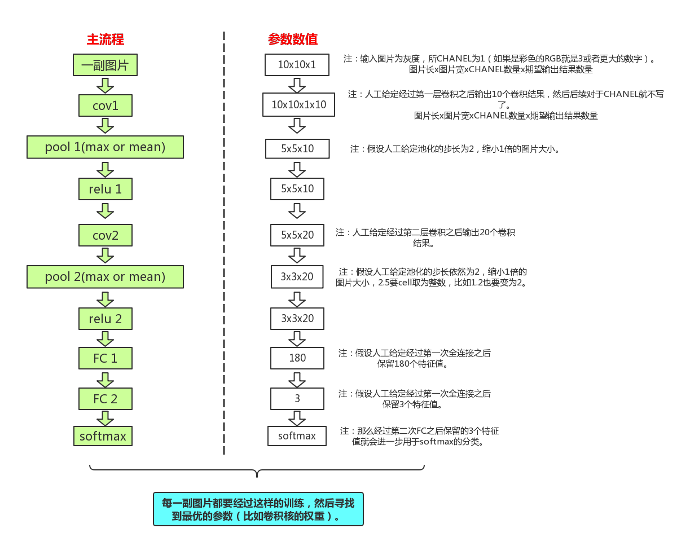
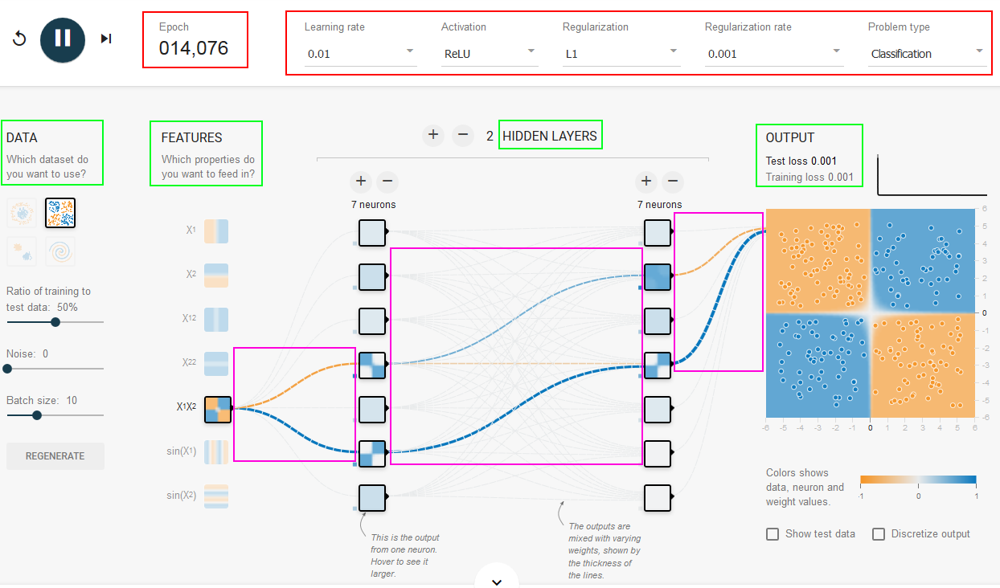

CNN basic knowledges
==========
- Record of some key notes by **QuSusu**.
- Some statements were directly copy from others.
- Start at 2018/04/23, last update at 2018/04/27.

----
**所谓卷积神经网络，就是会自动的对于一张图片学习出最好的卷积核以及这些卷积核的组合方式，也就是对于一张图片的任务来说，求出最好的图片对于本任务的特征的表达，然后来进行判断** 

[知乎：能否对卷积神经网络工作原理做一个直观的解释？](https://www.zhihu.com/question/39022858)

---

## I.基本概念（后续补充吧，今天来不及写这个了）
[机器学习相关的一个帖子](http://nooverfit.com/wp/category/cnn/)

## II. 参数设定 & 一个卷积过程的例子
### 1.参数设定
一般在我们进行一个CNN训练的时候，会涉及到两大类参数：超参数（Hyperparameters）和参数（parameters）。
- 超参数（Hyperparameters）：是我们根据经验人工给定的值。
- 参数（parameters）：是通过学习训练、不断改变得到的值，比如每次卷积核对应的权重，都是通过不断的给定一个值，然后根据学习情况调整直到找到最优。

超参数分别具体包括哪些过程的哪些值、如何给定这些值一个初始值、偏好值等等，详见下面的表格内容：

|过程|超参数|如何给定对应的初始值|偏好值|举例||
|:---|:---|:---|:---|:---|---|
| 卷积 | 卷积层数 | 人工给定 | 好像没有偏好值 | 2||
|   | 卷积核大小 | 人工给定 | 奇数 | 3x3 ||
|   | 特定卷积层对应的输出数量 | 人工给定 | 无 | 10 ||
| 池化 | 池化层数 | 人工给定 | 无 | 2 ||
|   | 池化后的输出大小 | 人工给定 | 一般会缩小 | 2x2 ||
| Relu | Relu的次数 | 人工给定 | 无 | 2 ||
| 全连接 | 全连接的次数 | 人工给定 | 无 | 2 ||
|   | 全连接的输出特征值个数 | 人工给定 | 无 |首次180，第二次为3 ||
| 其他 | 步长（stride） | 人工给定 | 无 | 2 ||
|   | 边界（padding） | 人工给定 | 无 | zero padding ||

---

### 2.一个卷积过程的例子
在实际做卷积的过程，可能最困惑的就是卷积核大小的选取、数据是由几维变成了几维、CNN的过程是如何的等等问题，那么结合上面关于参数的说明，来看一个非常简单的例子帮助理解数据的维度变换等细节内容：这是一个比较简单的例子：对每一副图片用两层卷积、两层池化、两次relu、两次全连接进行学习，对最后一次全连接的结果（n个特征）通过softmat函数进行分类。

### 3.其他
- 池化的作用：降维，或者说是为了更好的放大特征值之间的差别。
- 全连接：整合所有的特征值然后根据我们给定的个数提取其中关键的特征值，其实也是降维的一种方式（全连接的输出特征值的个数，也是我们人工给定的）。
- relu函数：非线性的转换，其实就是一个分类函数，会把矩阵中所有负数的值变为0。 
- softmax函数：根据经过最后一次全连接的特征值进行分类。softmax函数的作用呢，一是分类，二是给出量化的指标来说明有多大的比例可以分为该类别。

Deep learning knowledges
========================
最开始写这个文档只是想记录下对CNN的理解，今天被推荐了一个很好的深度学习资源相关的帖子：[如何看懂深度学习论文里的数学原理部分？](https://www.zhihu.com/question/266533669/answer/377229055)所以考虑后续是不是文章title要改一下。

TensorFlow Playground
=====================
***From 知乎：***
TensorFlow=tensor(张量)+flow(流动)，张量的流动；TensorFlow Playground的作者想要阐述的侧重点就是“张量如何流动”的。
Playground是一个图形化用于教学目的的简单神经网络在线演示平台，只是一个动态演示的网站，可视化了神经网络的训练过程，有助于加深对神经网络的理解。
知乎上看到一句话觉得形容的很贴切：每个神经元都是“傻傻的”，只会做一件事情，然后通过weight去组合协调，完成一件复杂的任务。而学习/训练的过程不过是去寻找选择最优weight的过程。

website：
- [GitHub-tensorflow playground](https://github.com/tensorflow/playground)
- [Brower-tensorflow playground](http://playground.tensorflow.org/)

图解：
从左到右依次为：数据集，特征值，隐含层和输出层。
- 红色框中表示的参数：迭代次数，激活函数等；
- 绿色框表示数据集、特征集等几个过程；
- 粉色框表示的是特征值的权重；