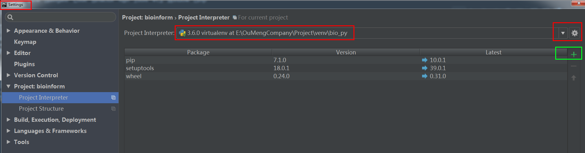

# GitHub related information
- ### qususu
- ### 2018/04/24
- ### Aim：刚开始使用github经常因为手残入坑，加上有时候还会陷入“脑残”的阶段，所以写个小记录帮助自己熟练、也希望对其他人受用。
- ### 整体还是觉得写的很乱、很散，希望随着使用的熟练可以总结的更简单、易懂！

 ---
## 准备工作
- 首先，在GitHub官网为自己创建一个GitHub账号吧；
- 其次，如果想将本地local的文件实时推送到GitHub的仓储上，那么需要：
	- 先在本地安装git bash for windows；
	- 安装好git之后，对于文件的同步（fectch，pull，push等）可以通过多种方式完成，这里主要介绍两种我在使用的：
		- GitHub Desktop客户端（简单易操作）；
		- pycharm（使用稍微繁琐一点，但因为我们通常需要写python脚本&对脚本注释，所以如果能直接将pycharm和GitHub建立联系那么就很方便）；
- 最后，还需要注意当我们有多台local电脑都在使用git客户端和git时，一定一定要保证登录的用户名和邮箱都一致，否则推送的时候不便于查看；以及建议用个人邮箱（非公司邮箱）来注册。一旦发现多个电脑的用户名不一致时，怎么更改，百度一下就好了，很简单！

## 通过GitHub Desktop客户端建立仓储、连接GitHub、pull、push等操作
这个比较简单，暂时先不写了。
- 蓝色标识是提示你会作为改变的文本被保存的，不要就点击一下。
- 绿色标识表示修改的内容。
- 红色标识表示删除。
- Summary就是这次改动的总结，我们也可以理解为标题（必填），而Description可以理解为详细更改内容（选填）

## 通过pycharm建立仓储、连接GitHub、pull、push等操作
- ### 这个部分就是坑比较多了，很多人都说pycharm很强大，确实强大，好多好多功能、好多好多plugins。可是事务必然是有两面性的，强大的功能我就觉得反面就是容易因为操作不当出错！！！所以这部分内容会啰嗦一点。
- ### 另外这个部分也同时会有一些python的使用tips。
- 首先是要为pycharm添加git.exe的程序，这样pycharm才可以使用git啊，简书上有一个教程写的还蛮清楚的，可以供参考：[pycharm连接github](https://www.jianshu.com/p/231584cb735b)
- 然后，添加了git能建立repo仓储了，但怎么同时管理好一个git的project、有python脚本需要安装包的时候安装在哪里（所以这个时候就推荐使用python的虚拟环境了）等等问题，我认为这些问题需要在刚刚学习git时候要用心一点，尤其对我这种小白。所以后面主要是写一些在实际使用过程中遇到的问题和需要注意的点。

- ### get了pycharm使用的一些小技巧：
- pycharm update：因一些python安装包的需要，要对pycharm update到2018.1.2版，该版本的激活方式可以参照[pyCharm最新2018激活码](https://blog.csdn.net/u014044812/article/details/78727496)链接中的第2种方式，亲测有效，哈哈！[其他激活码链接](http://xidea.online)
    - 安装新版的pycharm时，因为不确定是否有效，所以最好先别卸载旧版，把新版独立安装在新文件夹更保险。
- 一般针对每一个项目，最好通过建立python的虚拟环境作为解释器，关于pycharm中如何设置虚拟环境virtualenv截图供参考：

；

- Python使用requirements.txt安装类库（最好安装在对应的虚拟环境下）：可以通过建立一个requirements.txt文件，而该文件里存放了package的名字，那么pycharm就可以去自动检查是否安装了该包，然后如果没有就直接为你安装这些包；
- 安装TensorFlow的过程也get了另一种安装package的方式，如下图所示：

- 可以直接open 一个GitHub来建立一个仓储；
- pycharm可以新建仓储，然后直接将整个仓储share到GitHub上；
- 也可以先fetch 一个已经在GitHub上建立好的仓储到local，然后在pycharm里编辑；
- 但pycharm不能对一个新文件（之前毫无关系的）推送到一个已经建立好的仓储上；
- 对于本地仓储下的文件，如果增加了新的文件夹，那么要先add才能推送；
- 一般git下都会有对应的python程序，所以肯定会有对应的.idea文件夹，而这个是我们不想推送到git的，所以需要设置：.gitignore文件，忽略git不必要提交的文件；

推荐的其他帖子，还没来得及看呢，有时间的时候希望看下：
[Git 12 岁了，为你送上 12 个 Git 的使用技巧！](https://www.oschina.net/translate/12-git-tips-gits-12th-birthday?lang=chs)