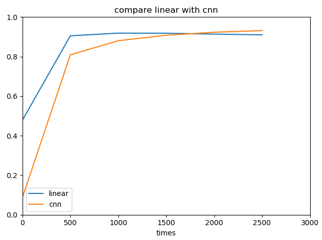
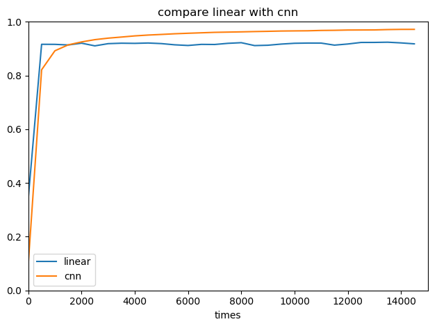

#Tensorflow
---
### - I: mnist test (一个经典案例)
### - 2018/04/20
### - 2018/05/02 modified
### - QuSusu
### - To understand what is CNN and how to use Tensorflow complete CNN. 
### - Reference on:[ChenYuelong's Example](ChenYuelong "https://chenyuelong.github.io/tensorflow_learn/mnist_test.html")
---

## 对于步长选择的理解：
可以对比下，两种步长0.1，0.01 的情况下预测准确率的差别，比如步长是0.1时，那么永远也达不到最优化的准确性效果（这就相当于A和B之间距离实际为0.2m，但是B每一步都要走1m，而且方向都是朝着一个距离在走，所以无论B走多少次，B和A直接的距离都无法最接近真实值）。不过一般推荐步长是：0.01~0.0001。

	e.g.：
	train_step=tf.train.GradientDescentOptimizer(0.01).minimize(cross_entropy)

		ssh://qususu@192.168.13.160:22/Bioinfo/MDDRD2/PMO/qususu/venv_python/ngs/bin/python3 -u /Bioinfo/MDDRD2/PMO/qususu/python/AI/mnist_test_qu.py
		Successfully downloaded train-images-idx3-ubyte.gz 9912422 bytes.
		Extracting MNIST_data/train-images-idx3-ubyte.gz
		Successfully downloaded train-labels-idx1-ubyte.gz 28881 bytes.s
		Extracting MNIST_data/train-labels-idx1-ubyte.gz
		Successfully downloaded t10k-images-idx3-ubyte.gz 1648877 bytes.
		Extracting MNIST_data/t10k-images-idx3-ubyte.gz
		Successfully downloaded t10k-labels-idx1-ubyte.gz 4542 bytes.
		Extracting MNIST_data/t10k-labels-idx1-ubyte.gz
		2018-04-20 13:51:13.935272: I tensorflow/core/platform/cpu_feature_guard.cc:137] Your CPU supports instructions that this TensorFlow binary was not compiled to use: SSE4.1 SSE4.2
		迭代次数为0,准确性为：0.2863
		迭代次数为500,准确性为：0.9091
		迭代次数为1000,准确性为：0.9020
		迭代次数为1500,准确性为：0.9160
		迭代次数为2000,准确性为：0.9140
		迭代次数为2500,准确性为：0.9068
		迭代次数为3000,准确性为：0.9172
		迭代次数为3500,准确性为：0.9217
		迭代次数为4000,准确性为：0.9091
		迭代次数为4500,准确性为：0.9200
		迭代次数为5000,准确性为：0.9056
		迭代次数为5500,准确性为：0.9205
		迭代次数为6000,准确性为：0.9142
		迭代次数为6500,准确性为：0.9143
		迭代次数为7000,准确性为：0.9221
		迭代次数为7500,准确性为：0.9143
		迭代次数为8000,准确性为：0.9228
		迭代次数为8500,准确性为：0.9036
		迭代次数为9000,准确性为：0.9211
		迭代次数为9500,准确性为：0.9110
		迭代次数为10000,准确性为：0.9159
		迭代次数为10500,准确性为：0.9231
		迭代次数为11000,准确性为：0.9174
		迭代次数为11500,准确性为：0.9217
		迭代次数为12000,准确性为：0.9211
		迭代次数为12500,准确性为：0.9194
		迭代次数为13000,准确性为：0.9147
		迭代次数为13500,准确性为：0.9195
		迭代次数为14000,准确性为：0.9228
		迭代次数为14500,准确性为：0.9199
		迭代次数为15000,准确性为：0.9142
		迭代次数为15500,准确性为：0.9152
		迭代次数为16000,准确性为：0.9233
		迭代次数为16500,准确性为：0.9197
		迭代次数为17000,准确性为：0.9251
		迭代次数为17500,准确性为：0.9176
		迭代次数为18000,准确性为：0.9128
		迭代次数为18500,准确性为：0.9200
		迭代次数为19000,准确性为：0.9133
		迭代次数为19500,准确性为：0.9197
		
		Process finished with exit code 0

	train_step=tf.train.GradientDescentOptimizer(0.1).minimize(cross_entropy)

		2018-04-20 14:01:21.919178: I tensorflow/core/platform/cpu_feature_guard.cc:137] Your CPU supports instructions that this TensorFlow binary was not compiled to use: SSE4.1 SSE4.2
		迭代次数为0,准确性为：0.3271
		迭代次数为500,准确性为：0.0980
		迭代次数为1000,准确性为：0.0980
		迭代次数为1500,准确性为：0.0980
		迭代次数为2000,准确性为：0.0980
		迭代次数为2500,准确性为：0.0980
		迭代次数为3000,准确性为：0.0980
		迭代次数为3500,准确性为：0.0980
		迭代次数为4000,准确性为：0.0980
		迭代次数为4500,准确性为：0.0980
		迭代次数为5000,准确性为：0.0980
		迭代次数为5500,准确性为：0.0980
		迭代次数为6000,准确性为：0.0980
		迭代次数为6500,准确性为：0.0980
		迭代次数为7000,准确性为：0.0980
		迭代次数为7500,准确性为：0.0980
		迭代次数为8000,准确性为：0.0980
		迭代次数为8500,准确性为：0.0980
		迭代次数为9000,准确性为：0.0980
		迭代次数为9500,准确性为：0.0980
		迭代次数为10000,准确性为：0.0980
		迭代次数为10500,准确性为：0.0980
		迭代次数为11000,准确性为：0.0980
		迭代次数为11500,准确性为：0.0980
		迭代次数为12000,准确性为：0.0980
		迭代次数为12500,准确性为：0.0980
		迭代次数为13000,准确性为：0.0980
		迭代次数为13500,准确性为：0.0980
		迭代次数为14000,准确性为：0.0980
		迭代次数为14500,准确性为：0.0980
		迭代次数为15000,准确性为：0.0980
		迭代次数为15500,准确性为：0.0980
		迭代次数为16000,准确性为：0.0980
		迭代次数为16500,准确性为：0.0980
		迭代次数为17000,准确性为：0.0980
		迭代次数为17500,准确性为：0.0980
		迭代次数为18000,准确性为：0.0980
		迭代次数为18500,准确性为：0.0980
		迭代次数为19000,准确性为：0.0980
		迭代次数为19500,准确性为：0.0980
		

## 对于每次迭代准确性不同的的理解：
因为初始值是随机的，所以结果不同，但是如果训练到最后，应该相差不大。

## linux下交互型来每次看下定义了什么、输出什么，更便于理解：
	sess =tf.InteractiveSession()
	sess.run(init)
	a.eval()

---

## some questions
占位符的个数，就是指x像素点的个数么？——yes
	
	x = tf.placeholder(tf.float32, [None, 784])

trained+test的数据集都读进来了吗？——yes
	
	mnist = input_data.read_data_sets("MNIST_data/", one_hot=True)

这个是指：将所有的数据集随机分成不同的batch，每个batch包含了128张图片，每次读取一个batch的图片；sess.run读取数据集的方式就是必须写成dict的形式；
	
	batch_xs, batch_ys = mnist.train.next_batch(batch_size=128,shuffle=True)

	acc = sess.run(accuracy, feed_dict={x: mnist.test.images, y_: mnist.test.labels})

为啥要传入这个？——为了后续的参数调整时，变化量很小时不会因为梯度推回而损失特征。

	keep_prob = tf.placeholder(tf.float32,name='keep_prob')

还是不清楚那个plt一张图片怎么显示啊？——plt.imshow???明天实验一下。
	
	MNIST_data：这下面的4个文件是4张片子——不是啊啊

因为传入的数据为转好的列向量，需要将他转化成矩阵的形式

	x_image = tf.reshape(cnn_x, [-1, 28, 28, 1])

Python学习def函数的定义、使用及参数传递（这个介绍比较好理解）

	https://blog.csdn.net/nysyxxg/article/details/42238541

python关于传参：

	https://blog.csdn.net/lis_12/article/details/54618868

知道TensorFlow有多讨厌么？安装很久安不上，总是显示如下报错：

    Could not find a version that satisfies the requirement tensorflow

然后试了1.5版本也不行，后来看提示说要升级pip，升级了pip到10.0，然后pycharm又得升级了……坑！升级了pycharm还是安装TensorFlow还是同样的报错，最后师傅帮检查发现是虚拟环境的设置有问题，给这个项目重新设置了一个python的虚拟环境竟然就好了！！！
总之，解决了就好，但确实有点坎坷，慢慢积累吧！

## MNIST test results & bug record:
### 迭代次数为20000，想尝试print('迭代次数为%05d,准确性为：%.4f'%(i,acc)) 输出对齐，但结果报错，报错如下：
    Traceback (most recent call last):
      File "E:/OuMengCompany/Project/git/temp/bioinform/src/mnist_test_qu.py", line 145, in <module>
        data.plot(x='times',xlim=(0,20000),ylim=(0,1),titile='compare linear with cnn')
      File "E:\OuMengCompany\Project\git\temp\venv\lib\site-packages\pandas\plotting\_core.py", line 2677, in __call__
        sort_columns=sort_columns, **kwds)
      File "E:\OuMengCompany\Project\git\temp\venv\lib\site-packages\pandas\plotting\_core.py", line 1902, in plot_frame
        **kwds)
      File "E:\OuMengCompany\Project\git\temp\venv\lib\site-packages\pandas\plotting\_core.py", line 1729, in _plot
        plot_obj.generate()
      File "E:\OuMengCompany\Project\git\temp\venv\lib\site-packages\pandas\plotting\_core.py", line 252, in generate
        self._make_plot()
      File "E:\OuMengCompany\Project\git\temp\venv\lib\site-packages\pandas\plotting\_core.py", line 977, in _make_plot
        **kwds)
      File "E:\OuMengCompany\Project\git\temp\venv\lib\site-packages\pandas\plotting\_core.py", line 993, in _plot
        lines = MPLPlot._plot(ax, x, y_values, style=style, **kwds)
      File "E:\OuMengCompany\Project\git\temp\venv\lib\site-packages\pandas\plotting\_core.py", line 607, in _plot
        return ax.plot(*args, **kwds)
      File "E:\OuMengCompany\Project\git\temp\venv\lib\site-packages\matplotlib\__init__.py", line 1855, in inner
        return func(ax, *args, **kwargs)
      File "E:\OuMengCompany\Project\git\temp\venv\lib\site-packages\matplotlib\axes\_axes.py", line 1527, in plot
        for line in self._get_lines(*args, **kwargs):
      File "E:\OuMengCompany\Project\git\temp\venv\lib\site-packages\matplotlib\axes\_base.py", line 406, in _grab_next_args
        for seg in self._plot_args(this, kwargs):
      File "E:\OuMengCompany\Project\git\temp\venv\lib\site-packages\matplotlib\axes\_base.py", line 396, in _plot_args
        seg = func(x[:, j % ncx], y[:, j % ncy], kw, kwargs)
      File "E:\OuMengCompany\Project\git\temp\venv\lib\site-packages\matplotlib\axes\_base.py", line 300, in _makeline
        seg = mlines.Line2D(x, y, **kw)
      File "E:\OuMengCompany\Project\git\temp\venv\lib\site-packages\matplotlib\lines.py", line 421, in __init__
        self.update(kwargs)
      File "E:\OuMengCompany\Project\git\temp\venv\lib\site-packages\matplotlib\artist.py", line 888, in update
        for k, v in props.items()]
      File "E:\OuMengCompany\Project\git\temp\venv\lib\site-packages\matplotlib\artist.py", line 888, in <listcomp>
        for k, v in props.items()]
      File "E:\OuMengCompany\Project\git\temp\venv\lib\site-packages\matplotlib\artist.py", line 881, in _update_property
        raise AttributeError('Unknown property %s' % k)
    AttributeError: Unknown property titile

    Process finished with exit code 1

现在在总结之前的bug才发现，提示错误里就已经告诉了错误行在145，然后AttributeError: Unknown property titile。所以，仔细看下报错是很必要的，不然就不至于来来回回跑好几次了……
其实是data.plot(x='times',xlim=(0,3000),ylim=(0,1),title='compare linear with cnn')这里的titile拼写错误了！！！

### 迭代次数为3000运行出来的结果，成功汇出图来了。
    E:\OuMengCompany\Project\git\temp\venv\Scripts\python.exe E:/OuMengCompany/Project/git/temp/bioinform/src/mnist_test_qu.py
    Extracting MNIST_data/train-images-idx3-ubyte.gz
    Extracting MNIST_data/train-labels-idx1-ubyte.gz
    Extracting MNIST_data/t10k-images-idx3-ubyte.gz
    Extracting MNIST_data/t10k-labels-idx1-ubyte.gz
    2018-05-01 10:22:12.183318: I C:\tf_jenkins\workspace\rel-win\M\windows\PY\36\tensorflow\core\platform\cpu_feature_guard.cc:137] Your CPU supports instructions that this TensorFlow binary was not compiled to use: AVX
    迭代次数为0,准确性为：0.4787
    迭代次数为500,准确性为：0.9053
    迭代次数为1000,准确性为：0.9187
    迭代次数为1500,准确性为：0.9182
    迭代次数为2000,准确性为：0.9138
    迭代次数为2500,准确性为：0.9100
    Extracting MNIST_data/train-images-idx3-ubyte.gz
    Extracting MNIST_data/train-labels-idx1-ubyte.gz
    Extracting MNIST_data/t10k-images-idx3-ubyte.gz
    Extracting MNIST_data/t10k-labels-idx1-ubyte.gz
    迭代次数为0,准确性为：0.0877
    迭代次数为500,准确性为：0.8093
    迭代次数为1000,准确性为：0.8803
    迭代次数为1500,准确性为：0.9079
    迭代次数为2000,准确性为：0.9232
    迭代次数为2500,准确性为：0.9315

    Process finished with exit code 0

看不出来cnn明显优于线性学习的效果，准备再试下15000，反正放假，提交了让它自己跑着了。

    E:\OuMengCompany\Project\git\temp\venv\Scripts\python.exe E:/OuMengCompany/Project/git/temp/bioinform/src/mnist_test_qu.py
    Extracting MNIST_data/train-images-idx3-ubyte.gz
    Extracting MNIST_data/train-labels-idx1-ubyte.gz
    Extracting MNIST_data/t10k-images-idx3-ubyte.gz
    Extracting MNIST_data/t10k-labels-idx1-ubyte.gz
    2018-05-01 11:18:30.040318: I C:\tf_jenkins\workspace\rel-win\M\windows\PY\36\tensorflow\core\platform\cpu_feature_guard.cc:137] Your CPU supports instructions that this TensorFlow binary was not compiled to use: AVX
    迭代次数为0,准确性为：0.3438
    迭代次数为500,准确性为：0.9162
    迭代次数为1000,准确性为：0.9160
    迭代次数为1500,准确性为：0.9137
    迭代次数为2000,准确性为：0.9204
    迭代次数为2500,准确性为：0.9104
    迭代次数为3000,准确性为：0.9186
    迭代次数为3500,准确性为：0.9203
    迭代次数为4000,准确性为：0.9197
    迭代次数为4500,准确性为：0.9210
    迭代次数为5000,准确性为：0.9188
    迭代次数为5500,准确性为：0.9143
    迭代次数为6000,准确性为：0.9118
    迭代次数为6500,准确性为：0.9159
    迭代次数为7000,准确性为：0.9155
    迭代次数为7500,准确性为：0.9198
    迭代次数为8000,准确性为：0.9222
    迭代次数为8500,准确性为：0.9114
    迭代次数为9000,准确性为：0.9127
    迭代次数为9500,准确性为：0.9170
    迭代次数为10000,准确性为：0.9200
    迭代次数为10500,准确性为：0.9208
    迭代次数为11000,准确性为：0.9207
    迭代次数为11500,准确性为：0.9131
    迭代次数为12000,准确性为：0.9173
    迭代次数为12500,准确性为：0.9231
    迭代次数为13000,准确性为：0.9232
    迭代次数为13500,准确性为：0.9240
    迭代次数为14000,准确性为：0.9214
    迭代次数为14500,准确性为：0.9179
    Extracting MNIST_data/train-images-idx3-ubyte.gz
    Extracting MNIST_data/train-labels-idx1-ubyte.gz
    Extracting MNIST_data/t10k-images-idx3-ubyte.gz
    Extracting MNIST_data/t10k-labels-idx1-ubyte.gz
    迭代次数为0,准确性为：0.0996
    迭代次数为500,准确性为：0.8213
    迭代次数为1000,准确性为：0.8921
    迭代次数为1500,准确性为：0.9141
    迭代次数为2000,准确性为：0.9250
    迭代次数为2500,准确性为：0.9335
    迭代次数为3000,准确性为：0.9391
    迭代次数为3500,准确性为：0.9432
    迭代次数为4000,准确性为：0.9475
    迭代次数为4500,准确性为：0.9506
    迭代次数为5000,准确性为：0.9529
    迭代次数为5500,准确性为：0.9554
    迭代次数为6000,准确性为：0.9573
    迭代次数为6500,准确性为：0.9590
    迭代次数为7000,准确性为：0.9607
    迭代次数为7500,准确性为：0.9616
    迭代次数为8000,准确性为：0.9625
    迭代次数为8500,准确性为：0.9636
    迭代次数为9000,准确性为：0.9645
    迭代次数为9500,准确性为：0.9656
    迭代次数为10000,准确性为：0.9661
    迭代次数为10500,准确性为：0.9665
    迭代次数为11000,准确性为：0.9678
    迭代次数为11500,准确性为：0.9683
    迭代次数为12000,准确性为：0.9693
    迭代次数为12500,准确性为：0.9695
    迭代次数为13000,准确性为：0.9697
    迭代次数为13500,准确性为：0.9710
    迭代次数为14000,准确性为：0.9717
    迭代次数为14500,准确性为：0.9718

    Process finished with exit code 0

